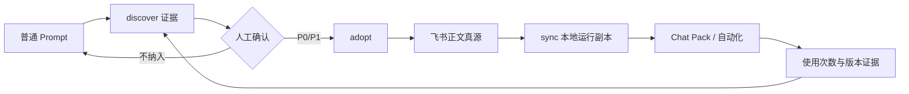

# Prompt 治理 V1

Prompt 默认是普通、可试用的文件；只有真实使用证明长期价值，并经人工确认 P0/P1，才纳入治理。

受治理 Prompt 有两个边界：飞书 `chatgpt-bridge-prompts/Learn-X` 文档是唯一人工正文真源；Learn-X `02_prompts/` 中的 Markdown 是本地运行副本。`00_config/prompt-assets.json` 只登记稳定 `prompt_id`、P0/P1、运行路径、派生关系和最后同步的 revision/hash，不保存第二份正文。

## 最小闭环

普通 Prompt → `discover` 提供使用/重复证据 → 人工决定 P0/P1 → `adopt` 创建或绑定飞书文档 → `sync` 更新本地副本 → Chat Pack/自动化继续读取本地副本并记录版本事实。



## 使用时校准（Snapshot 新鲜度）

不建后台监听。Snapshot 只在真正被在线消费时校准：`run-periodic-insight` 等在线入口在组装 Prompt 前执行 governance `check --live`；远端有新版本且本地干净时自动 `pull`，本地脏或漂移时保留旧版本并显式告警；离线（lark-cli 失败）继续使用本地副本并告警。距上次同步超过 7 天（`freshness: stale`）强告警但不阻塞运行。所有告警随运行状态落盘（`snapshot_preflight` 字段），不允许旧 Snapshot 静默存在。普通构建（`npm run build`）保持只验本地 manifest，不新增网络依赖。

Codex 在线组装 Chat Pack 或读取 `02_prompts/` 受治理正文时同样先跑 `status --live`（别名 `check`）再使用。

## 操作与失败

```bash
node /Users/yuwei/.codex/skills/prompt-governance/scripts/manage-prompts.mjs discover --project /Users/yuwei/code/learn-x
node /Users/yuwei/.codex/skills/prompt-governance/scripts/manage-prompts.mjs status --project /Users/yuwei/code/learn-x --live
```

`adopt` 和 `sync` 默认只预览；只有核对结果后才加 `--confirm`。飞书读取不完整、hash 不一致、路径越界、本地文件有未提交修改或本地副本漂移时停止且不写文件。普通 Prompt 的编辑和构建保持原状；受治理正文在本地编辑器中只读，需先在飞书修改再同步。

P0 表示核心工作流、高频长期使用或出错影响明显；P1 表示已重复使用且大概率继续维护。Governance 只负责身份、来源、版本、纳入、同步和使用事实；Chat Pack 负责组装，自动化负责执行，`learn-x-prompt-review` 负责内容契约/评测，Bridge 负责现有调用边界，Memory/道/法仍需人工确认。
