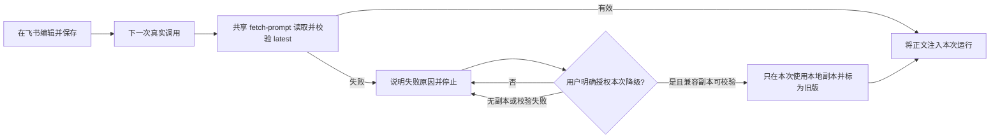

# Prompt 治理：飞书保存后下一次调用生效

## 真源与运行规则

飞书是受治理 Prompt 正文唯一人工真源。用户只在飞书维护正文；保存后，消费者下一次运行直接读取当前 latest。Prompt 正文不需要发布、同步或确认生效。

`00_config/prompt-assets.json` 登记稳定 `prompt_id`、优先级、兼容文件路径、派生关系和最近一次记录的 revision/hash。它是消费者与飞书文档之间的技术映射，不是第二份正文真源。revision、hash 与读取时间只作运行证据。

```mermaid
flowchart LR
  Edit[在飞书编辑并保存] --> Next[下一次真实调用]
  Next --> Reader[共享 fetch-prompt 读取并校验 latest]
  Reader -->|有效| Run[将正文注入本次运行]
  Reader -->|失败| Stop[说明失败原因并停止]
  Stop --> Consent{用户明确授权本次降级?}
  Consent -->|否| Stop
  Consent -->|是且兼容副本可校验| Local[只在本次使用本地副本并标为旧版]
  Consent -->|无副本或校验失败| Stop
  Local --> Run
```

消费者每次实际使用受治理 Prompt 前都调用共享 `fetch-prompt.mjs`。读取结果必须符合 `prompt-asset/v1`，并通过用户身份、Prompt 身份、revision、完整正文和 hash 校验。正文以内存方式传给本次调用；宿主必须接收路径时，只创建本次调用独立的临时文件并在结束后清理。不写共享 Prompt 缓存。

飞书读取失败时说明当前无法取得最新版本并停止。不得静默使用本地旧正文，也不得自动重试为旧正文。仅当存在可校验的既有兼容副本，且用户在失败后明确授权本次降级时，才可临时使用；结果须注明本地 revision/hash 不是飞书最新值。授权不保存到后续运行。需要回滚时在飞书恢复历史内容，之后的调用自然读取恢复后的版本。

## Learn-X 消费者

- Chat Pack 本地服务提供 `POST /api/chatpack/prompts/latest`。请求只能选择 `00_config/prompt-assets.json` 中登记的 ID；多个 Prompt 任一读取失败则整包失败，不返回部分正文。接口不缓存，并只接受本机回环与同源请求。
- Chat Pack 在每次生成前读取所选受治理主 Prompt 与增强器，直接将本次最新正文放入生成输入。失败时显示原因，不生成、不复制。公开静态版不打包受治理正文，并禁用对应入口；非治理 Prompt 保持可用。
- `learn-x-weekly-journal` 和 `learn-x-monthly-journal` 每次生成前分别读取 `learn-x.weekly-journal`、`learn-x.monthly-journal`，不再读取本地旧正文。
- 周期洞察运行时按当前子类型映射读取受治理 Prompt latest。状态只记录 `prompt_id`、revision、hash 和 `prompt_fetched_at`，不保存正文；读取失败时不启动 Bridge。
- Weekly、Monthly、Yearly Output 主 Prompt 分别使用 `chatpack.weekly-output`、`chatpack.monthly-output`、`chatpack.yearly-output`。Chat Pack 生成入口负责实时读取；其他入口须先运行共享读取器并遵循本次返回的 `content`。
- 未登记为受治理 Prompt 的本地适配内容继续按现有方式工作。

## 登记与维护

普通 Prompt 可以先作为非治理文件试用。`discover`、`adopt` 用于治理资产的发现和登记。治理维护、状态诊断与兼容副本修复工具仍可显式使用，但 `status --live`、`sync`、`publish` 不再是日常 Prompt 使用步骤，也不改变“飞书保存后下一次调用生效”的语义。

本地编辑器不直接改写受治理正文。受治理正文在飞书修改并保存后，所有实时消费者在下一次调用自动读取；用户无需关注本地兼容副本是否同步。P0 表示核心工作流、高频长期使用或出错影响明显；P1 表示已有重复使用且大概率继续维护。

Governance 负责 Prompt 身份映射、latest 读取和运行证据；Chat Pack 负责组装，自动化负责执行，`learn-x-prompt-review` 负责内容契约与评测。Prompt 不自动写入 Memory、Core 正式道法或 Flomo。
