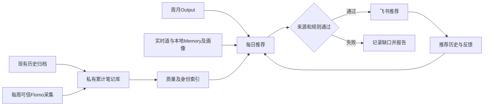
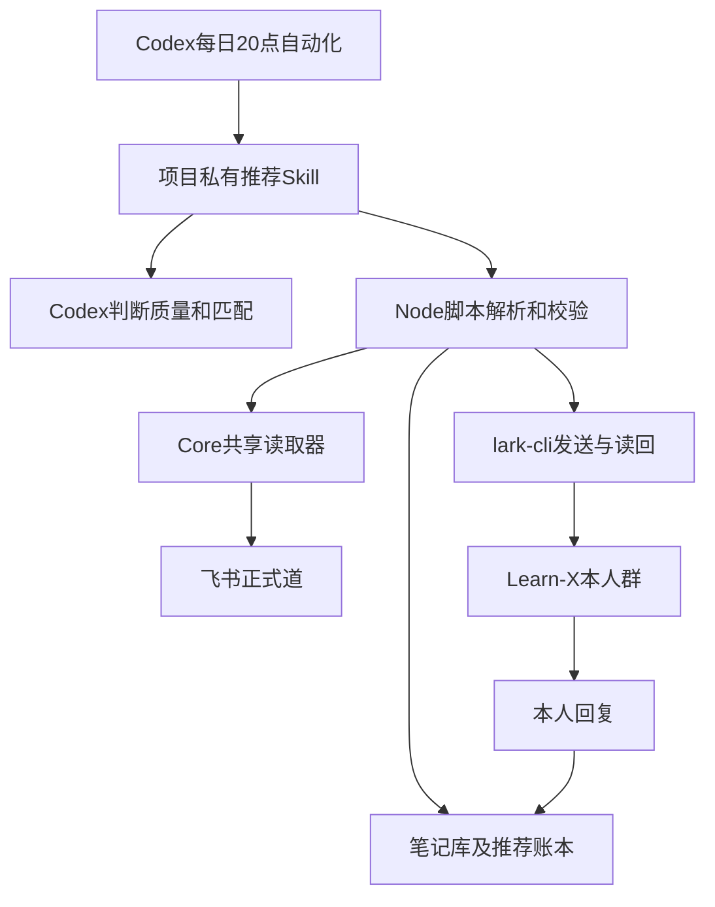
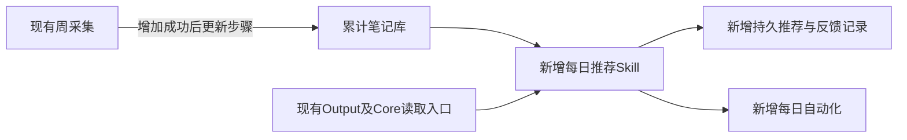

# Execution Plan｜Flomo 每日回顾推荐

- 状态：已确认
- 最后核对日期：2026-10-06
- 上下游链接：[Requirement](../../requirements/2026-10-flomo-daily-review.md) → [Case](case.md)
- 来源：上一条完整方案，用户明确要求实施。

## 方案原文

# Flomo 每日回顾推荐方案

## 1. 目标与路线

**在 Learn-X 内维护累计笔记库，每周补充，每天20:00结合近期与长期上下文，推荐3–6条值得回顾的笔记。**

采用已确认的「本地库＋周更新」路线。日常推荐不访问 Flomo，不另建独立服务；现有规模先用本地文件、确定性校验和 Codex 判断，无需引入向量数据库。

调查确认：

- 本地约有771段历史笔记，尚未核验为完整全量，也未全部通过质量筛选。
- 每周流程采集目标周笔记；智慧之门只接收带「需回顾」标签的增量。
- 部分历史笔记没有 Flomo ID，必须保留本地原文入口。
- 正式《道》已通过 Core 共享读取器实时读取成功；本地季度 Memory、个人理解文件均存在。
- 新周采集器尚未验收，存在日期字段不一致，复用前必须修正。
- 工作区有其他任务正在修改周流程，实施时保护并核查既有改动。

首版承诺的是**历史归档库＋每周新增补充**。按创建时间采集无法发现所有旧笔记的远端编辑、删除，因此不能宣称与当前 Flomo 全量实时一致。

## 2. 推荐规则

### 数量与质量

正常运行每天3–6条，按以下顺序选择：

1. 高质量且与近期 Output 明确相关的笔记。
2. 不足3条时，从高质量、与长期《道》、Memory或个人关注相关的笔记中补足，并说明关联较弱。
3. 超过3条的补充项，必须同时具有较高质量和明确的当下回顾价值；最多6条。

质量判断要求具体依据：有独立思考、真实经验、清晰表达、可迁移判断或审美价值。短诗、短思考不因篇幅短而被排除；空泛口号、残缺内容、重复搬运不因关键词匹配而入选。

允许推荐能挑战近期判断的笔记，避免只强化已有观点。每条保存原文依据、上下文出处和推荐理由。

**不得降低质量或突破去重规则凑数。**若连3条高质量候选都没有，当天记为未达标并报告原因，不伪装为正常推荐。

### 过滤与身份

- 整条排除所有 `learn-x` 标签及其层级子标签，忽略大小写；同时排除已知 Learn-X 同步生成标题和标记。
- 沿用「不回顾」「不洞察」「AI洞察」等已有排除边界。
- 手写笔记仅在正文讨论 Learn-X，不因此被排除。
- 原文、日期无法可靠解析，正文不完整，或来源明确为 `failed/unavailable` 的记录不得进入候选。
- 历史归档无侧车时按兼容规则读取，标为历史快照；保留覆盖缺口。

有真实 `memo_id` 时用稳定身份；无 ID 时建立本地 `note_key`，保存来源文件和记录边界，不编造 Flomo 链接。后来补到 ID 时合并别名并保留推荐历史。同 ID 改文不重置历史；无法可靠关联的变化先隔离。完全相同内容的复本共用推荐去重身份，防止通过不同来源绕过限制。

### 重复限制

统一使用 Asia/Shanghai 的 ISO 周，周一至周日：

| 规则 | 精确口径 |
|---|---|
| 同周不重复 | 一条笔记在同一周最多推荐一次 |
| 周间最多5条 | 当前有效四周窗口内，任意两周的推荐笔记交集不超过5条 |
| 四周最多10次 | 当前周＋前三周，计算「推荐总次数－不同笔记数」，不超过10 |
| 窗口外解除限制 | 更早周不再参与上述限制；历史保留，不删除 |

例如，同一笔记四周各推荐一次，产生3次重复。一个月的限制按已确认的四周口径执行，不另加自然月限制。

上线前验证容量：每天至少3条，完整四周至少84次；最多10次重复，因此至少需要**74条不同的合格笔记**。

### 时间分布

按整周实际送达量统计，作为软目标：

- 近30天：20%–30%。
- 近365天合计：80%–90%，包含近30天部分。
- 超过365天：通常10%–20%，目标不超过20%。

年龄按笔记原始创建时间计算，不按入库时间。质量和重复硬约束优先；偏离比例时记录原因，不用低质量笔记补年龄配额。

### 上下文与反馈

每天重新读取：

- 最近4个已结束周、最近2个已结束月的实质性 Output，优先最新周期。
- Core 正式《道》，复用现有实时读取器，仅取正式正文。
- 本地活跃季度／年度 Memory。
- `01_core` 下现有个人理解文件，不另建人物画像。

兼容 Output 的 H1–H6 标题，读取完整正文。占位文件不算有效上下文；部分周期缺失列入清单，周和月全部缺失则停止推荐。《道》读取失败不得静默回退。较早画像标注更新时间，不能覆盖新的 Output 证据；Memory 候选也不能当已确认认知。

反馈保存在私有目录 `04_output/_dist/flomo-review/`，与推荐历史关联。你回复推荐消息，例如“第2条有帮助”“第1条跳过”，即可记录。

- 按被回复消息、批次和序号定位，只接受本人明确反馈。
- 每日收集过去四周推荐消息的回复；更早反馈支持按日期补采。
- 分页完整后才更新采集状态，重复读取不重复记账。
- “跳过”只是反馈，不自动永久屏蔽或修改 Flomo 标签；没有回复不推断为负面反馈。
- 不自动写入 Memory、正式道法或人物画像。

## 3. 数据流与实现

复杂度：需求高2＋系统高2＋影响面中1＝5，复杂档。

实现边界：

- 脚本负责解析、身份合并、日期、过滤、重复计数、持久化和发送校验；Codex负责语义判断。脚本不调用外部 AI 接口。
- 首次批量判断笔记质量并建立简短索引，按正文哈希复用；新增或修改笔记重新判断。每天先看索引，最终入选前必须复读原文。
- 周采集成功后更新累计库；日运行也检查本地新增归档，避免周流程某个后续阶段停住而遗漏更新。
- 私有数据落在现有 Git 忽略目录。笔记库保留原文、创建时间、身份别名、来源、正文哈希和来源状态；每日批次保留上下文清单、入选依据、发送状态和反馈。
- 预览只生成候选与统计，不计入已推荐历史。正式发送前在互斥锁下重新核验来源版本和重复预算，并预留当日批次。
- 发送使用持久日期键与稳定幂等键。飞书幂等键只有有限有效期，不能替代本地账本。
- 状态采用 `reserved → sending → delivered`；不确定结果进入 `needs_review`，保留占用，只读恢复，不自动重发。明确未发送的失败才释放预留。

推送沿用实时核验后的 Learn-X 本人群及既有 bot 身份。每天一条消息，包含编号、创建日期、原文摘录、推荐理由和真实来源链接。没有 Flomo ID的历史笔记注明来源；随消息附当日 Markdown，提供全部入选原文。

发送前核验接收范围和频率，发送后读回消息及内容。跨日不补发过期批次；手动验收发送也计入当天，避免晚上再次推送。

## 4. 实施里程碑与落盘包

| 里程碑 | 实施内容 | 验证与停止条件 |
|---|---|---|
| M0 文档保存 | 保存用户需求原文、历次裁决、完整方案与交接信息；核查现有改动 | 来源和文档读回一致后才进入实现；本轮规划不写文件 |
| M1 穿通真实路径 | 用少量真实笔记完成建库、完整上下文读取、3条推荐、飞书发送读回和反馈采集；修正必要的采集日期错误 | 复跑不重复发；真实采集能收录已知范围内笔记、排除范围外笔记。失败停在此处 |
| M2 完成存量与规则 | 解析全部历史归档、建立质量索引，接入周增量，完成四周账本与年龄统计 | 输出覆盖、排除、身份冲突和容量报告；至少74条合格独立笔记，并通过7日及28日模拟 |
| M3 定时上线 | 通过 Codex 自动化工具配置每日20:00项目工作流，提示词引用项目 Skill和配置 | 首个完整自然周验收每日送达、同周零重复、数量、反馈和配比；失败保留账本并暂停发送 |

回退通过暂停每日自动化、移除新增周更新调用完成。原始归档、笔记身份、推荐历史和反馈保留，避免回退后丢失去重依据。实施完成后再更新 Architecture Truth。

目标仓库：`/Users/yuwei/code/learn-x`。Case：`2026-10-flomo-daily-review`。M0保存三份文档：

- `docs/requirements/2026-10-flomo-daily-review.md`：逐字保存当前用户需求及追加裁决，整理已确认基线。
- `docs/cases/2026-10-flomo-daily-review/execution-plan.md`：完整保存本方案，附 Execution Handoff。
- `docs/cases/2026-10-flomo-daily-review/case.md`：来源索引、实际进度、证据、下一里程碑和停止点。

原文来源为本聊天中完整的人类消息；方案来源为本次完整计划。保存时按共用契约捕获原文，不从摘要重建。交接附录记录六类信息：已确认决定、背景限制、假设未知、调查证据、相关入口、易误解事项。来源无法取得或出现冲突时停止M0。

新增项目 Skill 使用 `skill-creator`；本轮不创建自动化、不发送消息、不修改数据。

## 5. 验收与剩余边界

| 编号 | 前提与动作 | 可观察结果 |
|---|---|---|
| ACC1 入库 | 导入历史格式、重复来源、无ID笔记和可信周增量 | 每条可追溯；重复导入不增加记录；未知ID不生成假链接 |
| ACC2 排除 | 加入大小写和层级 Learn-X 标签、生成正文、失败残留文件 | 整条不进入推荐；手写正文提到Learn-X仍可正常评估 |
| ACC3 数量质量 | 准备强相关、弱相关高质量、关键词匹配但空泛的候选 | 正常3–6条；补足项说明依据；低质量不入选；容量不足明确未达标 |
| ACC4 去重 | 模拟连续28天、跨周、跨年和第五周 | 同周零重复；窗口内两周交集≤5、重复次数≤10；过期历史不继续限制 |
| ACC5 身份变化 | 无ID补ID、同ID改文、复本、身份合并 | 不获得新的推荐资格；合并后按规范身份重算历史，冲突隔离 |
| ACC6 上下文 | 使用真实W40标题格式、缺失周期、旧画像、道读取失败 | 完整读取且出处可查；缺项可见；不把旧画像标为最新；道失败停止 |
| ACC7 年龄 | 检查30天、365天边界及小样本一周 | 包含关系正确，按整周统计，偏离有原因 |
| ACC8 发送恢复 | 并发运行、超时、远端送达后进程崩溃、人工重跑 | 无重复消息；不确定结果只读核验；账本与真实消息对应 |
| ACC9 反馈 | 回复不同日期的“第2条”、多项反馈、分页、编辑及重复读取 | 正确绑定笔记；不漏页、不重复计数；歧义不猜；未回复无负面推断 |

已完成的是只读调查与规划：正式《道》实时读取成功；现有4个采集单测通过，但都使用模拟扫描，不能证明真实浏览器路径可用。

仍需实施验证：完整合格库存是否达到74条、真实推荐质量、采集分页完整性、群身份及消息权限、推送与反馈闭环。

会话标题：Flomo 每日回顾推荐方案

## Execution Handoff

### 用户已确认的关键决定
见完整方案及Requirement追加确认。
### 重要背景与限制
周流程有并行任务的脏改动，不覆盖；私有笔记和上下文不得进入Git。
### 关键假设与尚存未知
真实Ego扫描、74条合格供给、推送与反馈权限待验收。
### 已完成调查或Spike的结果及证据
约771段历史；正式道规划期读取rev7；模拟采集4/4不等于真实路径。
### 相关文件、模块、接口和外部资料
Learn-X输入/周自动化、Core read-core-truth.mjs、lark-cli im，共用契约dev-workflow/docs/templates/planning-assets.md。
### 执行中容易误解的重要信息
四周是当前+前三ISO周；画像有旧成功版本；发送不确定时不重发。
