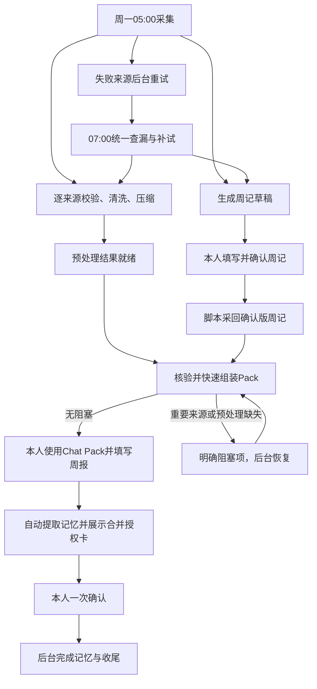
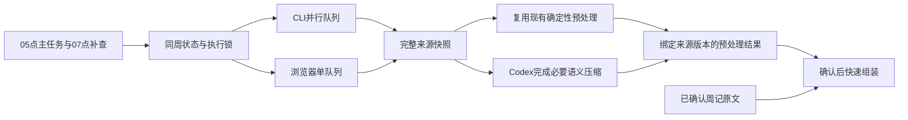
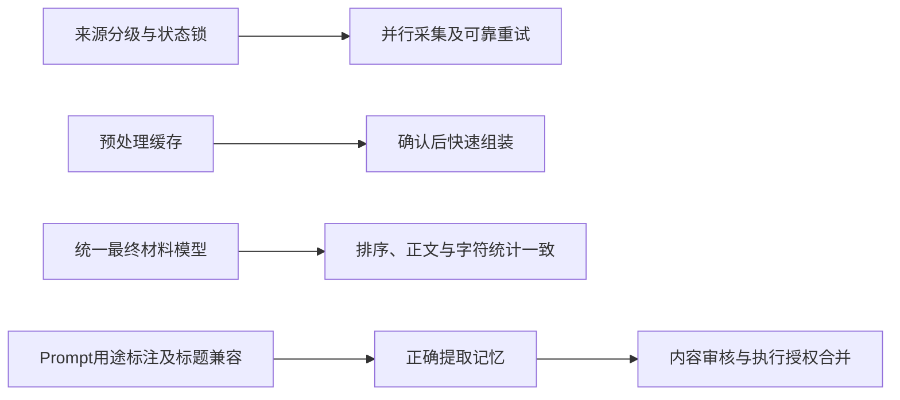

# Execution Plan｜周记自动化优化：提前预处理、分级重试与三步交互

- 状态：已确认
- 最后核对日期：2026-10-05
- 上下游链接：../../requirements/2026-10-weekly-workflow-efficiency.md → case.md
- 来源：用户消息 01a10abc-80dc-7e33-a978-75e6b56b2abb，完整正文逐字捕获。

## 方案原文
PLEASE IMPLEMENT THIS PLAN:
# 周记自动化优化：提前预处理、分级重试与三步交互

## 1. 目标与整体流程

在现有流程上做最小充分修改：保留周记模板、周一05:00启动和手动Chat Pack，把采集、校验、压缩提前完成，缩短人工步骤之间的等待。

目标：

- 本人参与时间平均约15分钟，通常不超过30分钟。
- 正常情况下，“周记已确认”到Process Pack交付不超过一分钟。
- 重要来源失败醒目提示，可选来源不阻塞。
- 正常流程只有三个操作环节，不追加独立的Pack、Memory确认口令。

三个操作环节：

1. **填写并确认周记。**
2. **审阅Process Pack，使用Chat Pack生成并填写周报。**
3. **查看记忆内容与执行授权合并卡，一次确认收尾。**



两道门槛保持区别：

- **周记草稿：** 重要来源齐全可提前生成；07:00补试结束后，有有效日记就允许生成，其他缺口明确标注。
- **Process Pack：** 日记、Flomo、AI回顾、Voice及其适用的预处理必须通过。Flomo、Voice完整查询后的可信零条允许通过；日记为空、AI空壳不能通过。

## 2. 来源分级、排序与重试

优先级用于关注和执行排序，阻断资格单独维护。因此，可选来源也可以是P0。

### 重要输入：阻断Process Pack

| 顺序 | 来源 | 优先级 |
| --- | --- | --- |
| 1 | 日记 | P0 |
| 2 | Flomo | P0 |
| 3 | AI回顾 | P0 |
| 4 | Voice | P0 |

### 可选输入：缺失不阻断

| 顺序 | 来源 | 优先级 |
| --- | --- | --- |
| 1 | 健康 | P0 |
| 2 | Core复盘 | P0 |
| 3 | 微信读书 | P1 |
| 4 | 日历 | P1 |
| 5 | 智慧之门 | P1 |
| 6 | 精读 | P1 |
| 7 | Coach | P2 |
| 8 | Build、Build-Bot、按需微信 | P2 |

一份来源配置统一驱动采集顺序、两张汇报表、Pack索引和正文顺序。已确认周记作为阶段前提单列。

### 重试规则

- 重要组：首次执行后最多重试4次。
- 可选组：首次执行后最多重试2次。
- 每次从失败结束起等待20分钟；服务端要求更长冷却时遵守更长间隔。
- 周一07:00统一查漏，为仍缺失、可安全恢复的来源额外补试一次。
- 07:00不重置次数，不重复启动正在执行的任务，不重跑成功来源。
- 成功零条不重试。权限、登录、字段契约和人工接管问题明确报告，不盲目循环。
- ChatGPT已提交或提交状态不明时只恢复原结果观察，不重新发送。
- Health、Build、Build-Bot等外部拥有的产物只重新检查，不擅自启动其生产流程。

复用现有05:00本地自动化，增加07:00本地补查任务。用有界执行器保存重试状态，结束后退出，不新增常驻服务。

独立CLI来源最多3路并行；浏览器任务使用单队列。Flomo完整采集→需回顾笔记幂等导入→智慧之门采集仍按依赖执行。

## 3. 提前预处理与一分钟快路径

### 最小改动

复用现有采集器、解析、去重、Voice压缩和字符统计函数，只补齐三项能力：

- 来源级后台编排与持久重试状态。
- 现有`process:weekly`的提前预处理能力。
- 正常目标周周记采回入口。

目前已经核实的缺口包括：状态文件并发会丢更新、Coach失败可能连带标记日记失败、正常周记采回仍靠现场CLI操作、微信读书压缩后需人工更新四处统计、Voice压缩可能绕过中文标题。

### 确认前完成的工作

来源采集成功后立即预处理，不等待所有来源完成，也不等待周记确认：

- 校验目标周、覆盖范围和来源完整性。
- 清洗、逐来源去重。
- 完成Voice压缩、微信读书语义压缩及普通超长输入处理。
- 保存可复用正文和原始→清洗→预处理字符链路。
- 提前准备上周Output对照。

语义压缩仍由Codex完成；脚本负责候选校验、缓存和组装，不在脚本中调用外部AI。

预处理结果绑定目标周、来源哈希、采集版本和规则版本。来源或规则变化只使对应结果失效；旧任务晚到不能覆盖新版本。

原始输入保持完整，压缩正文单独保存。普通15,000字符限制用于相应Pack候选，不再把固定尺寸问题当网络采集失败。正常流程不调用会覆盖原始输入、要求额外确认的压缩应用步骤。

**周记不压缩。** 已确认周记超过15,000字符仍完整纳入，不在确认后增加压缩门槛。

阶段1可以保存私有预处理材料，但不生成正式`input.json`、Process Pack、Weekly Output或Memory。



### 确认后的快路径

复用现有命令，增加准备模式：

```bash
npm run process:weekly -- --week YYYY-Www --prepare
```

收到“周记已确认”后，自动执行正常采回与最终组装：

```bash
npm run input:weekly -- --week YYYY-Www
npm run process:weekly -- --week YYYY-Www
```

这些由流程自动调用，不要求本人分别运行。

确认后只做：

1. 利用草稿阶段保存的目标锚点，窄范围读取确认版周记。
2. 核验本周来源状态、哈希及预处理版本。
3. 加入未压缩周记，完成轻量跨来源去重。
4. 统一生成正文、两张来源表、索引和字符统计。
5. 校验后交付正式Pack及Output最小壳。

正常路径不重新采集、不临时语义压缩、不手工修改统计。锚点失效时重新定位目标周，不用相邻旧周兜底；缓存失效时明确报告具体来源并回到后台预处理。

### 压缩与计数正确性

- Voice按记录结构识别任意标题，修复仅识别`with …`的问题。
- 长Voice记录维持10%–15%目标保留比例；短记录例外明确标注。
- 微信读书压缩结果与来源哈希绑定，重新生成Pack不能丢失已完成压缩。
- 总表、索引、压缩概览和正文共用最终材料模型，不再人工改四处数字。
- 最终纳入字符在跨来源去重后重新计算。
- 分别报告来源正文总字符、上周对照字符和完整Pack字符。
- 100%保留不得显示为“已压缩”；可选来源压缩不合格时明确排除，不能伪装完成。

草稿及Pack一旦交付，不因迟到输入静默重写本人正在使用的版本。



## 4. 记忆、收尾与异常监控

### Memory来源

保留现有0–3条长期候选，并明确标题用途：

- `值得长期保留（长期记忆候选，勾选后纳入）`
- `本周最值得思考的3个问题与回答（已填写的完整问答纳入候选记忆）`
- `全文核心重点纪要（纳入本周Memory）`
- `芒格之魂的洞察（纳入芒格洞察候选池）`

纪要和洞察不要求再勾选。未答、空白、占位和主动跳过的问答自动排除，不追加交互。修复背景说明被误认成回答的问题，并兼容新旧标题。

不另生成一份AI摘要冒充Memory。自动准备具体拟迁移内容，展示一张合并卡：

- 纪要、洞察、真实已答问答及主动勾选条目。
- 排除项和实际Memory目的地。
- 图片路径、备份范围与目的地、留存清理。
- YWNext刷新、Flomo同步对象及读回要求。

本人一次确认，同时完成内容审核和执行授权。执行前检查周报及拟写入内容哈希，变化后不能沿用过期批准。

### 收尾依赖

Memory成功后，图片与YWNext可并行。备份等待图片步骤完成；Flomo等待前置校验。

Flomo若回写允许的小修改，刷新受影响的索引和备份，保证最终版本一致。备份比较载荷哈希，不只按“同周成功过”跳过。

季度目标按目标周周一的真实自然年月统一计算，修复跨年拼接错误，不迁移历史Memory。

### 异常监控

分别记录采集、重试等待、预处理、周记采回、Pack组装、卡片准备和收尾耗时。

每次异常保存：

- 来源、步骤、错误分类及发生次数。
- 本次尝试、下次重试和最后安全状态。
- 可核查证据。
- 已确认根因、待验证假设和修复建议。

固定超长输入、缓存失效、网络失败分别处理，避免无效重试。正常环境确认后超过一分钟，记录具体慢步骤。

重要输入首次阻塞即醒目提示；同周连续3次相同错误或连续2周失败，输出诊断摘要。状态无变化时不重复长篇通知。日志只保留技术元信息，不保存私人正文、凭据或原始响应。

## 5. 实施、验收与落盘

### 最小里程碑

| 里程碑 | 实施内容 | 验证与停止条件 |
| --- | --- | --- |
| M0 | 保存需求、完整方案、Case，核对现有改动 | 原文与裁决读回一致；保护无关脏文件 |
| M1 | 穿通真实入口→提前预处理→确认周记→快速Pack | 测量一分钟目标，证明无需确认后语义加工；失败先定位，不继续扩展 |
| M2 | 完成分级重试、07补查、锁与恢复 | 验证后台恢复、同源竞争、次数与间隔；不重复外部副作用 |
| M3 | 完成两组排序、压缩与统计一致性 | 逐来源统计与最终正文一致，重要源缺失被拦截 |
| M4 | 完成Memory提取、合并卡和收尾监控 | 一次授权、未答题无追问、去重及最终版本读回通过 |

### 验收矩阵

| 验收 | 前提→动作→可观察结果 |
| --- | --- |
| ACC1 | 预处理完成→确认周记→正常环境一分钟内获得Pack，无临时压缩 |
| ACC2 | 其他重要来源失败、日记有效→07补试结束→草稿可生成，Pack明确阻塞 |
| ACC3 | 可选来源缺失→继续→缺口可见，合格Pack不被拖住 |
| ACC4 | 临时失败→后台恢复→重要重试4次、可选2次，07额外一次，间隔不少于20分钟 |
| ACC5 | 05/07竞争或进程中断→恢复→不丢状态、不重置次数、不重复提交 |
| ACC6 | 来源变化或旧候选晚到→组装→拒绝过期候选，只重做对应来源 |
| ACC7 | 中文标题Voice、微信读书、超长输入→预处理→压缩真实完成，原始材料保留 |
| ACC8 | 已确认周记超过15,000字符→采回→完整纳入，不要求压缩 |
| ACC9 | 空回答、问号背景、新标题→提取→只保留真实已答问答，不漏纪要与洞察 |
| ACC10 | 查看合并卡→一次确认→记忆与收尾执行、去重、读回，无分拆授权 |
| ACC11 | 慢步骤或重复失败→监控→原因与证据持久记录，推测不冒充根因 |

连续记录3个正常周运行，评估本人平均15分钟、通常不超过30分钟的目标。外部服务等待与本人深度思考分别计时。

### 落盘包

目标仓库：`/Users/yuwei/code/learn-x`。Case：`2026-10-weekly-workflow-efficiency`。

实施M0保存：

- `/Users/yuwei/code/learn-x/docs/requirements/2026-10-weekly-workflow-efficiency.md`：全部用户需求原文、确认基线及追加裁决。
- `/Users/yuwei/code/learn-x/docs/cases/2026-10-weekly-workflow-efficiency/execution-plan.md`：本版完整方案及Execution Handoff，标明替代前版。
- `/Users/yuwei/code/learn-x/docs/cases/2026-10-weekly-workflow-efficiency/case.md`：索引、真实进度、证据与下一步。

完整来源是本会话`01a10a89-3a0d-7e20-a177-a03e4ece3f63`的用户消息及本方案；按规划资产契约捕获原文，不用摘要重建。

Prompt修改走飞书真源治理；Skill修改使用skill-creator。清理退役Action Feedback、旧编号、旧排序及阶段边界矛盾。实施后再更新Architecture Truth。

本方案已进入实施并完成本地实现；下方 Implementation Handoff 记录当前实现与验证状态。后台恢复、真实飞书采回及一分钟目标仍必须取得实际运行证据。回退只针对本次变更，保留人工内容、原始输入与诊断记录；不另建仓库、应用或工作流平台。

会话标题：周记自动化优化：提前预处理、分级重试与三步交互


## Execution Handoff
### 用户已确认的关键决定
- 完整方案获用户明确实施授权；以上方案原文不改写，后续裁决只追加于本附录。
- 保留周一05:00、模板和手动 Chat Pack；实现三步交互、分级重试/07查漏、预处理快路径、Memory与授权合并卡。
- 周记不压缩；真实周记采回、后台恢复、一分钟耗时尚无证据。
- 2026-10-05追加裁决：第二步 Process Pack 阶段展示执行授权卡，提前说明收尾动作、授权范围和目标路径，不展示尚未生成的记忆内容；第三步展示实际记忆条目，并与已预览的授权信息合并为完整卡片，一次确认。用户最新澄清覆盖此前对第二步展示记忆内容的理解。

### 重要背景与限制
- 本轮开始前工作区已有25个已修改/删除路径，涉及 input/process/weekly Skills、脚本、测试、文档和前端；均作为既有基线保护。
- learn-x-process 与 learn-x-weekly-automation 对阶段门禁、采集顺序、压缩时点、来源排序有不一致描述；现有脏改动需合并。
- 日记/Coach联合入口存在逻辑失败域耦合；状态侧车并发读改写可能丢更新。
- 规划时 Learn-X缺完整 Flomo 周采集器；实施后已补齐采集器，Ego Lite完整周扫描仍待真实运行验证；Research-X导入器只取 #需回顾。
- 正常周记采回依赖现场 CLI；缺少目标周 input:weekly 入口。
- Pack生成仍在确认后执行 Voice 与 WeRead 压缩，WeRead需人工改四处计数。
- Health/Build/Build-Bot只重新检查；ChatGPT已提交或状态不明只观察恢复、不盲重发。
- 使用现有 Unicode 字符计数，只在授权范围内处理个人内容。

### 关键假设与尚存未知
- 一分钟是服务正常时目标，尚未实际测量。
- 05:00后的有界worker持续性和07:00中断接管需本机实测。
- 周记锚点及飞书窄范围读回需真实验证。
- 全量 Flomo collector 已实现；Ego Lite页面遍历及完整周证据待真实运行验证；禁止 Chrome/CDP/私有API。
- 第二步执行授权范围预览已规定在交付 Process Pack 的同一条阶段 2 回复中；它不生成或展示 Memory 内容，也不调用独立消息发送器。按同一条回复呈现的行为契约已纳入回归断言。
- 三个正常周人类参与时间样本尚不存在。

### 已完成调查或 Spike 的结果及证据
- 读取 docs/LEARN_X_PROCESS.md、03_input/usage.md、04_output/usage.md、weekly automation/process Skills。
- 定位状态竞争、日记与 Coach 耦合、WeRead压缩后置、周记采回缺脚本、超长输入采集拦截。
- Flomo适配器结论来自线程内只读调查，不是实测证据。

### 相关文件、模块、接口和外部资料
- .agents/skills/learn-x-input/scripts/lib/source-status.mjs
- .agents/skills/learn-x-weekly-automation/SKILL.md 及 scripts/
- .agents/skills/learn-x-input/scripts/
- .agents/skills/learn-x-process/scripts/collect-weekly-input.mjs
- .agents/skills/learn-x-process/scripts/generate-weekly-process-pack.mjs
- .agents/skills/learn-x-process/scripts/prepare-weekly-memory.mjs
- package.json；docs/architecture.md（仅实施事实完成后更新）。
- Skill遵循 /Users/yuwei/.codex/skills/.system/skill-creator/SKILL.md；Prompt遵循 /Users/yuwei/code/skills/prompt-governance/SKILL.md 与飞书真源契约。

### 执行中容易误解的重要信息
- 阶段1可保存私有预处理和草稿，不生成正式 input.json、Process Pack、Weekly Output 或 Memory。
- 成功零条须有完整扫描证据；重要门槛独立于优先级；日记有效、AI不可为空壳。
- 07:00不重置次数、不重跑成功源、不与活跃任务重复；未知ChatGPT提交只观察原任务。
- 迟到源不覆盖已交付产物；缓存失效需明确指明来源。
- 第二步展示执行动作、范围与目标路径预览，不展示尚未生成的 Memory，也不构成授权；第三步在 Memory 实际生成后展示内容与完整授权卡并一次确认。授权前后核验周报及拟写内容哈希。
- 未经真实外部验证不得宣称线上成功。

### Implementation Handoff｜2026-10-07

- M0资产已核对；M1–M4的本地实现已落地：持久来源重试与锁、05:00/07:00恢复门槛、来源预处理缓存、确认版周记锚点采回、Process Pack 快速组装、第二步授权范围预览、第三步真实记忆与授权合并确认。
- 追加审查修复：死锁回收增加互斥；AI仅在明确预检失败时安全重试；07:00有界等待活动任务与服务冷却，并接手05:00有界期限内未启动的安全来源一次；Flomo/Voice验证完整范围、分页、下界、记录数；超长输入候选必须压至15,000字符内；锚点创建原子化并按日期边界匹配；Stage 1缺重要输入时等待07:00门槛。
- 隔离端到端模拟通过：临时仓库中模拟 05:00 来源瞬时失败、20 分钟虚拟冷却和 07:00 恢复，再执行周记锚点/桩式采回、提前预处理、Process Pack 快速组装及 Memory 候选准备；未调用真实 Flomo、Ego Lite、飞书写入、Memory、图片、备份或同步。
- 模拟发现 Process Pack 汇总曾把可信的 Flomo / Voice 完整零条扫描误报为阻断；已调整为继续在来源行展示零条证据，但不进入阻断提醒。修正后的回归断言通过。
- 全仓 `npm test` 421/421、`git diff --check` 均通过。本次没有运行真实 Flomo、Ego Lite、飞书周记写入或 Memory/备份/同步，因此不能把外部验收或一分钟目标记为完成。
- `learn-x-v2` 与 `learn-x-07-00` 自动化已按同一门槛更新，应用更新结果为 ACTIVE；调度实际触发与持锁恢复仍待未来运行证据。
- 下一步在未来正常周运行补足外部验收；本地验证不触发外部写入。
- 第二步卡片契约核对：Skill要求阶段 2 的 Process Pack 消息同时包含固定范围与目标路径预览，不展示尚未生成的记忆内容且不构成授权；阶段 3 再把实际候选与同一范围合并为一次确认卡。端到端回归断言验证两阶段边界文本。
