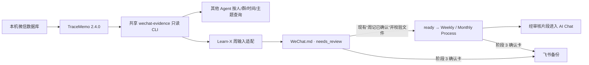

# Execution Plan｜微信 Evidence Source：TraceMemo 接入与 7 天 PoC（节点②产物）

> 任务期资产：本次施工计划，不自动升级为长期真值。冻结需求见 [requirement](../../requirements/wechat-evidence-source.md)（R1–R8）；新鲜度裁决见 [ADR 0001](../../adr/0001-wechat-evidence-freshness-coverage.md)。

## 1. 问题定义、当前状态与目标状态

人工截图采样造成微信历史遗漏；目标改为「本机 TraceMemo 只读查询 + 派生 `WeChat.md` + 人工确认入周流程」。

当前状态（事实，均已实读核验）：

- **F1** 来源状态契约 `wechat → "wechat.md"`（小写）：`learn-x-input/scripts/lib/source-status.mjs:11`（`SOURCE_FILES`）。
- **F2** `wechat-weekly-input` 写 `WeChat.md`（大写）：`skills/wechat-weekly-input/scripts/append-wechat-captures.mjs`；旧截图存在于 `03_input/weekly/2026-W33、W34、W37/WeChat.md`。
- **F3** 失败状态过滤按 basename 匹配且只排除「已登记且非 ready」：`learn-x-process/scripts/collect-weekly-input.mjs:115`（`filterFilesBySourceStatus`）；无状态条目的文件直接进入 input.json / Process Pack。`feishu-docs` 已有专属 fail-closed（:26–34），wechat 无。
- **F4** 周输入目录为 `03_input/weekly/YYYY-Www/`，单文件超限即停止（:75–82）；上限 `MAX_WEEKLY_INPUT_CHARS`（input-limits.mjs，当前 15,000）。
- **F5** 备份整目录上传：`backup-weekly.mjs:13` `BACKUP_ROOTS = ["01_core", "03_input", "04_output"]` → 飞书云空间。
- **F6** 现有确认口令与三阶段流程：`learn-x-weekly-automation/SKILL.md`（「周记已确认」→ 阶段 2；阶段 1 自动生成 AI 回顾与飞书周记草稿）。
- **F7** 本机未安装 TraceMemo；Apple Silicon、微信 4.1.13、SIP 启用（2026-09-24）。

推断：新生成器若按 R5 写 `WeChat.md` 而不改契约，会复现 F2 大小写绕过；若只登记小写状态，文件名又不匹配。未知：真实连接、Key 获取、跨分片完整性、7 天可靠性（见 requirement §7）。

## 2. 目标、非目标和不变量

目标＝R1–R8。非目标见 requirement §3。不变量：原始聊天库、Knowledge 索引、未筛选结果与 API Token 不进入 Learn-X 输入或云端；`WeChat.md` 只含经筛选、脱敏、人工审核的派生证据；Evidence 不自动成为 Memory；不启用 Agent Hub、微信发送或机器人操作。

## 3. 推荐方案（含已裁决决策）

架构：本机微信库 → TraceMemo 2.4.0（SIP 启用，官方 arm64 构建）→ 共享 Skills 仓库 `wechat-evidence` 只读 CLI（Node 标准库、查询白名单、本机脱敏、计数/时间/哈希日志）→ 各 Agent 按需查询；Learn-X 周输入适配 → `WeChat.md`（`needs_review`）→ 现有「周记已确认」＋文件校验 → `ready` → Weekly / Monthly Process → 阶段 3 确认卡 → 飞书备份。

已裁决：ADR 0001（按需新鲜度＋覆盖「未证实」）；规范文件名 `WeChat.md`＋只创建不覆盖；未知群默认围观群（本人前后各 5 条）＋人工配置覆盖；确认口令复用「周记已确认」，不新增确认阶段；Token 走本机私有凭据，不入参数/日志/Skill/模型上下文。

## 4. 影响面

- **learn-x**：`learn-x-input`（source-status 契约 wechat 文件名统一 + 新生成器/适配开关）、`learn-x-process`（collect-weekly-input fail-closed、weekly/monthly 消费校验、backup-weekly 哈希校验）、`learn-x-weekly-automation`（确认提示突出微信文件与覆盖缺口）、`wechat-weekly-input`（保留为人工回退路径）。
- **skills 共享仓库**：新增 `wechat-evidence` Skill（skill-creator + 全局注册 + symlink）。
- **不改动**：`01_core/`、`02_prompts/`、旧周数据、既有未提交改动（见 case 工作区保护）。

## 5. 系统图

## 6. 异常、兼容、迁移、回滚与恢复

- API 失败：保留旧文件、状态置 `failed/unavailable`、明确提醒；不拿旧内容补本周结果。
- 回滚：停用适配器开关即恢复人工截图路径，无须迁移旧周数据；旧截图与用户改过的文件不自动删除。回滚不能撤回已进入 AI Chat 或飞书备份的内容——阶段 3 确认卡必须列出微信派生片段及其 Process Pack 副本；真实外发只在文件审核、哈希核验和该确认之后。
- 连接若必须调整 SIP：停下单独评估，不自动降低系统保护。

## 7. 分阶段实施步骤（每步含验证与恢复点）

> 节点①：本步骤 0 已于 2026-09-24 完成（本文档与 case/requirement/ADR/architecture 落盘）。步骤 1–5 属节点③，待用户明确授权后执行。

| # | 改什么 | 涉及文件/位置 | 如何验证 | 失败如何恢复 |
|---|---|---|---|---|
| 1 | 验证真实连接：官方 2.4.0 arm64 构建，SIP 启用；用户界面核对数据库目录与账号；约 30 条已知消息交叉核验（私聊/深度群/围观群/不同日期） | 本机 TraceMemo 安装 | 30/30 可定位；`/agent/status.accountId` 不作数 | 不安装/连接失败即停，Learn-X 不动 |
| 2 | 共享只读适配器：受限查询、覆盖提示、本机脱敏、会话扫描、仅计数/时间/哈希 PoC 日志 | skills 仓库 `wechat-evidence/` | 先合成消息测试，再真实账号核对 | 测试失败不进步骤 3 |
| 3 | Learn-X 接入：统一 `WeChat.md` 状态契约（F1/F2 大小写）、未登记新文件 fail-closed（F3）、周/月消费与备份哈希校验（F4/F5）、自动生成＋`needs_review` | learn-x `learn-x-input`/`learn-x-process`/`learn-x-weekly-automation` | 合成测试＋重跑回归（同周重跑、用户编辑、旧文件、异常大小写） | 保留旧文件；关适配器回人工截图路径 |
| 4 | 7 天 PoC：每日已知新增消息核对＋索引覆盖检查；模拟一次 401/503/超时与一次现场停服演练；重复运行 Weekly Process 对账来源数量与输出 | 本机＋learn-x 周流程 | 无可核对新增消息的日期记「未证实」并延长；第 7 天出通过/部分通过/停止报告 | 触发 requirement §8 停止条件即停自动周消费 |

## 8. 成功标准与验证方式

见 requirement §6 验收矩阵（六项：账号正确、新鲜度不冒充完整、上限与漏采可见、最小披露与审核、重跑及旧数据兼容、故障与恢复）。每项的预期证据均须可对账：`WeChat.md`、`_source-status.json`、Process Pack 与备份清单。

## 9. 未决事项、残余风险和停止条件

- 未决：真实连接与账号核验（步骤 1 前置）；TraceMemo 查询上限与分片行为须以 2.4.0 源码实测（`local-query-api-service.ts`、`wcdb4-client.ts`）。
- 残余风险：PoC 只能证明已枚举本机会话及抽检范围内未发现缺口（ADR 0001）；`sourceLatestAt` 不代表手机端已同步；平台治理风险不可表述为「无风险」。
- 停止条件：实际漏采、错账号、未脱敏外发、持续连接失败 → 停止自动周消费并按 §6 回滚。
