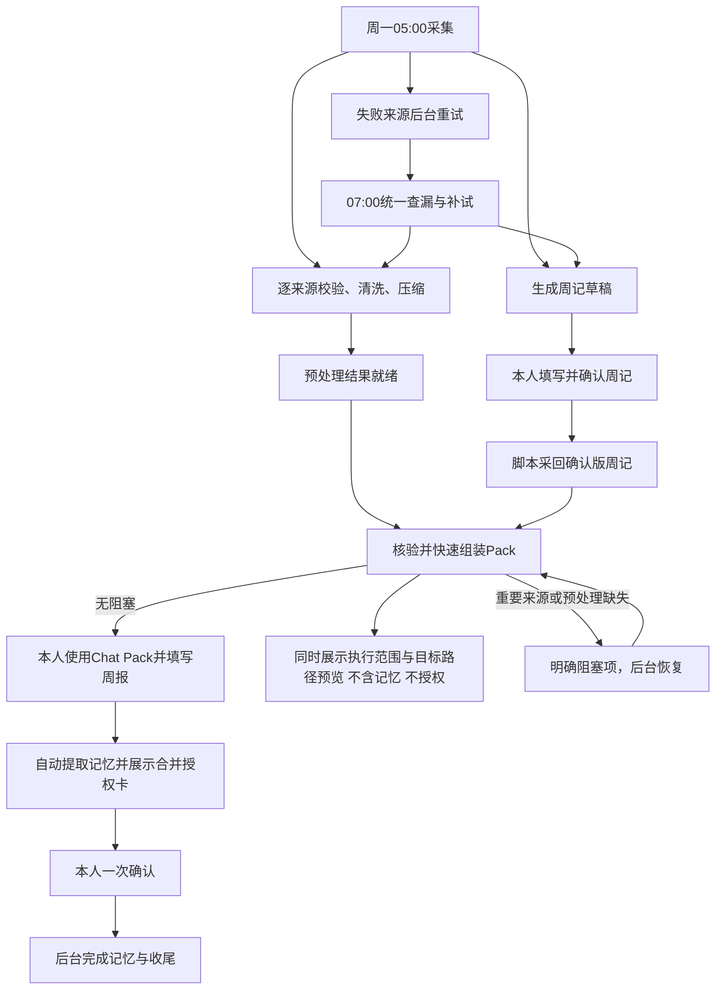
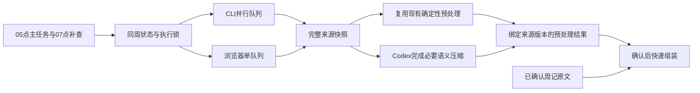
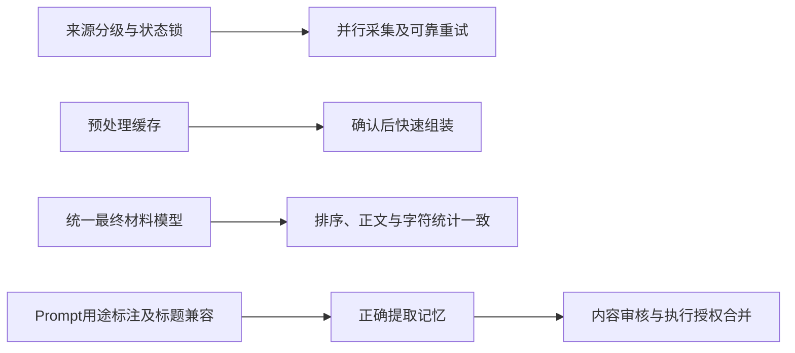

# Requirement Truth｜周记自动化效率优化

- 状态：已确认
- 最后核对日期：2026-10-05
- 上下游链接：本会话 01a10a89-3a0d-7e20-a177-a03e4ece3f63 → ../cases/2026-10-weekly-workflow-efficiency/execution-plan.md → ../cases/2026-10-weekly-workflow-efficiency/case.md
- 来源与确认依据：用户消息 01a10abc-80dc-7e33-a978-75e6b56b2abb, 01a10ac2-4f98-7421-9307-4382c997e4c0, 01a10ab0-c25a-7433-8dc6-f2a87925ec12, 01a10aaa-e2f8-7f60-b4d9-36010789fc04, 01a10aad-ed33-7273-bed5-cccb69907837, 01a10a8a-5a2a-7f50-8ce6-95b1ab6552e8, 01a10a9c-be92-7b40-8b8b-8d44826adc0e；完整方案获明确实施授权。

## 来源原文
<!-- 按时间顺序保存需求相关自然语言原文；附件界面包装不视为额外需求。 -->
<!-- message_id: 01a10a9c-be92-7b40-8b8b-8d44826adc0e -->
现在还有一个问题，就是整个需要我交互的阶段好多。当然了，失败的时候是额外的流程交互。但如果一切顺利的话，我感觉也有好多步，包括填周记。 Forces pack确认记忆，然后授权，这都有四步。我觉得记忆和授权明显可以放到一步，以及现在记忆是不是有点问题？你也看一看，现在周提示词里面已经不会生成记忆了。那么这个记忆到底是从哪来呢？其实我理解现在的记忆应该就是全文核心重点纪要、芒格之魂的洞察；本周最值得思考的 3 个问题与回答如何填了可以作为候选记忆长期


<!-- message_id: 01a10a8a-5a2a-7f50-8ce6-95b1ab6552e8 -->
周记 input 采集流程增加重试流程（最多重试 3 次，每次 20 分钟间隔）
整体周记自动化流程，我觉得还需要再优化一下，包括前面说的重试流程以及一些填写流程。总之，要尽量简化，该并行的并行，提高效率。

现在整体来看，每次填写整个过程要半小时，甚至有时候要一小时。当然，一部分原因是前面的重试机制等，偶尔也比较容易出现问题。然后现在流程也比较长。

调用 ywplan skill


<!-- message_id: 01a10aad-ed33-7273-bed5-cccb69907837 -->
可以稍微快一点，不过你还是要在原来的完整方案下进行优化，遵循奥姆提刀原则，不要完整重新弄，补充最核心内容就行了。


<!-- message_id: 01a10aaa-e2f8-7f60-b4d9-36010789fc04 -->
我突然发现，本人填写并确认周记后面还有一个重要输入与压缩全部通过。那么重要输入与压缩全部通过这件事情本身也可以前面做呀。不用等着我确认周记后再做压缩呀。周记本身也是不用做压缩的。所以这样一来，我填写完周记，理论上就可以立马执行。而且尽量是那种只要没阻塞嘛，我们就跑脚本。Process Pack你也看一下怎么做到快速跑脚本。现在是不是还有一些流程是没有快速跑脚本的？所以我理解未来我顺的时候，我就填写并确认周记，然后Process Pack。可能一分钟内就可以Process Pack，Process Pack走完后，我填完内容后，我就可以按照后面的流程一步完成。哦，不对呀，我前面还说了，提取记忆和展示合并卡要在一起。哦，好像你现在是说在一起的，反正就是一步嘛，所以总体我就三步。填写周记、Process Pack确认，并且步与步之间要尽量的快，而不是现在可能还有些慢。并且我们还需要做一些监控，针对异常情况。然后把异常情况的核心原因记录下来，未来优化的时候也更好优化。


<!-- message_id: 01a10ab0-c25a-7433-8dc6-f2a87925ec12 -->
你输出完整的方案呀，我咋没看到完整的方案？


<!-- message_id: 01a10abc-80dc-7e33-a978-75e6b56b2abb -->
PLEASE IMPLEMENT THIS PLAN:
# 周记自动化优化：提前预处理、分级重试与三步交互

## 1. 目标与整体流程

在现有流程上做最小充分修改：保留周记模板、周一05:00启动和手动Chat Pack，把采集、校验、压缩提前完成，缩短人工步骤之间的等待。

目标：

- 本人参与时间平均约15分钟，通常不超过30分钟。
- 正常情况下，“周记已确认”到Process Pack交付不超过一分钟。
- 重要来源失败醒目提示，可选来源不阻塞。
- 正常流程只有三个操作环节，不追加独立的Pack、Memory确认口令。

三个操作环节：

1. **填写并确认周记。**
2. **审阅Process Pack，使用Chat Pack生成并填写周报；Process Pack交付时同时看到执行授权范围预览。**
3. **查看实际记忆内容与完整执行授权合并卡，一次确认收尾。**



两道门槛保持区别：

- **周记草稿：** 重要来源齐全可提前生成；07:00补试结束后，有有效日记就允许生成，其他缺口明确标注。
- **Process Pack：** 日记、Flomo、AI回顾、Voice及其适用的预处理必须通过。Flomo、Voice完整查询后的可信零条允许通过；日记为空、AI空壳不能通过。

## 2. 来源分级、排序与重试

优先级用于关注和执行排序，阻断资格单独维护。因此，可选来源也可以是P0。

### 重要输入：阻断Process Pack

| 顺序 | 来源 | 优先级 |
| --- | --- | --- |
| 1 | 日记 | P0 |
| 2 | Flomo | P0 |
| 3 | AI回顾 | P0 |
| 4 | Voice | P0 |

### 可选输入：缺失不阻断

| 顺序 | 来源 | 优先级 |
| --- | --- | --- |
| 1 | 健康 | P0 |
| 2 | Core复盘 | P0 |
| 3 | 微信读书 | P1 |
| 4 | 日历 | P1 |
| 5 | 智慧之门 | P1 |
| 6 | 精读 | P1 |
| 7 | Coach | P2 |
| 8 | Build、Build-Bot、按需微信 | P2 |

一份来源配置统一驱动采集顺序、两张汇报表、Pack索引和正文顺序。已确认周记作为阶段前提单列。

### 重试规则

- 重要组：首次执行后最多重试4次。
- 可选组：首次执行后最多重试2次。
- 每次从失败结束起等待20分钟；服务端要求更长冷却时遵守更长间隔。
- 周一07:00统一查漏，为仍缺失、可安全恢复的来源额外补试一次。
- 07:00不重置次数，不重复启动正在执行的任务，不重跑成功来源。
- 成功零条不重试。权限、登录、字段契约和人工接管问题明确报告，不盲目循环。
- ChatGPT已提交或提交状态不明时只恢复原结果观察，不重新发送。
- Health、Build、Build-Bot等外部拥有的产物只重新检查，不擅自启动其生产流程。

复用现有05:00本地自动化，增加07:00本地补查任务。用有界执行器保存重试状态，结束后退出，不新增常驻服务。

独立CLI来源最多3路并行；浏览器任务使用单队列。Flomo完整采集→需回顾笔记幂等导入→智慧之门采集仍按依赖执行。

## 3. 提前预处理与一分钟快路径

### 最小改动

复用现有采集器、解析、去重、Voice压缩和字符统计函数，只补齐三项能力：

- 来源级后台编排与持久重试状态。
- 现有`process:weekly`的提前预处理能力。
- 正常目标周周记采回入口。

目前已经核实的缺口包括：状态文件并发会丢更新、Coach失败可能连带标记日记失败、正常周记采回仍靠现场CLI操作、微信读书压缩后需人工更新四处统计、Voice压缩可能绕过中文标题。

### 确认前完成的工作

来源采集成功后立即预处理，不等待所有来源完成，也不等待周记确认：

- 校验目标周、覆盖范围和来源完整性。
- 清洗、逐来源去重。
- 完成Voice压缩、微信读书语义压缩及普通超长输入处理。
- 保存可复用正文和原始→清洗→预处理字符链路。
- 提前准备上周Output对照。

语义压缩仍由Codex完成；脚本负责候选校验、缓存和组装，不在脚本中调用外部AI。

预处理结果绑定目标周、来源哈希、采集版本和规则版本。来源或规则变化只使对应结果失效；旧任务晚到不能覆盖新版本。

原始输入保持完整，压缩正文单独保存。普通15,000字符限制用于相应Pack候选，不再把固定尺寸问题当网络采集失败。正常流程不调用会覆盖原始输入、要求额外确认的压缩应用步骤。

**周记不压缩。** 已确认周记超过15,000字符仍完整纳入，不在确认后增加压缩门槛。

阶段1可以保存私有预处理材料，但不生成正式`input.json`、Process Pack、Weekly Output或Memory。



### 确认后的快路径

复用现有命令，增加准备模式：

```bash
npm run process:weekly -- --week YYYY-Www --prepare
```

收到“周记已确认”后，自动执行正常采回与最终组装：

```bash
npm run input:weekly -- --week YYYY-Www
npm run process:weekly -- --week YYYY-Www
```

这些由流程自动调用，不要求本人分别运行。

确认后只做：

1. 利用草稿阶段保存的目标锚点，窄范围读取确认版周记。
2. 核验本周来源状态、哈希及预处理版本。
3. 加入未压缩周记，完成轻量跨来源去重。
4. 统一生成正文、两张来源表、索引和字符统计。
5. 校验后交付正式Pack及Output最小壳。

正常路径不重新采集、不临时语义压缩、不手工修改统计。锚点失效时重新定位目标周，不用相邻旧周兜底；缓存失效时明确报告具体来源并回到后台预处理。

### 压缩与计数正确性

- Voice按记录结构识别任意标题，修复仅识别`with …`的问题。
- 长Voice记录维持10%–15%目标保留比例；短记录例外明确标注。
- 微信读书压缩结果与来源哈希绑定，重新生成Pack不能丢失已完成压缩。
- 总表、索引、压缩概览和正文共用最终材料模型，不再人工改四处数字。
- 最终纳入字符在跨来源去重后重新计算。
- 分别报告来源正文总字符、上周对照字符和完整Pack字符。
- 100%保留不得显示为“已压缩”；可选来源压缩不合格时明确排除，不能伪装完成。

草稿及Pack一旦交付，不因迟到输入静默重写本人正在使用的版本。



## 4. 记忆、收尾与异常监控

### Memory来源

保留现有0–3条长期候选，并明确标题用途：

- `值得长期保留（长期记忆候选，勾选后纳入）`
- `本周最值得思考的3个问题与回答（已填写的完整问答纳入候选记忆）`
- `全文核心重点纪要（纳入本周Memory）`
- `芒格之魂的洞察（纳入芒格洞察候选池）`

纪要和洞察不要求再勾选。未答、空白、占位和主动跳过的问答自动排除，不追加交互。修复背景说明被误认成回答的问题，并兼容新旧标题。

不另生成一份AI摘要冒充Memory。自动准备具体拟迁移内容，展示一张合并卡：

- 纪要、洞察、真实已答问答及主动勾选条目。
- 排除项和实际Memory目的地。
- 图片路径、备份范围与目的地、留存清理。
- YWNext刷新、Flomo同步对象及读回要求。

本人一次确认，同时完成内容审核和执行授权。执行前检查周报及拟写入内容哈希，变化后不能沿用过期批准。

### 收尾依赖

Memory成功后，图片与YWNext可并行。备份等待图片步骤完成；Flomo等待前置校验。

Flomo若回写允许的小修改，刷新受影响的索引和备份，保证最终版本一致。备份比较载荷哈希，不只按“同周成功过”跳过。

季度目标按目标周周一的真实自然年月统一计算，修复跨年拼接错误，不迁移历史Memory。

### 异常监控

分别记录采集、重试等待、预处理、周记采回、Pack组装、卡片准备和收尾耗时。

每次异常保存：

- 来源、步骤、错误分类及发生次数。
- 本次尝试、下次重试和最后安全状态。
- 可核查证据。
- 已确认根因、待验证假设和修复建议。

固定超长输入、缓存失效、网络失败分别处理，避免无效重试。正常环境确认后超过一分钟，记录具体慢步骤。

重要输入首次阻塞即醒目提示；同周连续3次相同错误或连续2周失败，输出诊断摘要。状态无变化时不重复长篇通知。日志只保留技术元信息，不保存私人正文、凭据或原始响应。

## 5. 实施、验收与落盘

### 最小里程碑

| 里程碑 | 实施内容 | 验证与停止条件 |
| --- | --- | --- |
| M0 | 保存需求、完整方案、Case，核对现有改动 | 原文与裁决读回一致；保护无关脏文件 |
| M1 | 穿通真实入口→提前预处理→确认周记→快速Pack | 测量一分钟目标，证明无需确认后语义加工；失败先定位，不继续扩展 |
| M2 | 完成分级重试、07补查、锁与恢复 | 验证后台恢复、同源竞争、次数与间隔；不重复外部副作用 |
| M3 | 完成两组排序、压缩与统计一致性 | 逐来源统计与最终正文一致，重要源缺失被拦截 |
| M4 | 完成Memory提取、合并卡和收尾监控 | 一次授权、未答题无追问、去重及最终版本读回通过 |

### 验收矩阵

| 验收 | 前提→动作→可观察结果 |
| --- | --- |
| ACC1 | 预处理完成→确认周记→正常环境一分钟内获得Pack，无临时压缩 |
| ACC2 | 其他重要来源失败、日记有效→07补试结束→草稿可生成，Pack明确阻塞 |
| ACC3 | 可选来源缺失→继续→缺口可见，合格Pack不被拖住 |
| ACC4 | 临时失败→后台恢复→重要重试4次、可选2次，07额外一次，间隔不少于20分钟 |
| ACC5 | 05/07竞争或进程中断→恢复→不丢状态、不重置次数、不重复提交 |
| ACC6 | 来源变化或旧候选晚到→组装→拒绝过期候选，只重做对应来源 |
| ACC7 | 中文标题Voice、微信读书、超长输入→预处理→压缩真实完成，原始材料保留 |
| ACC8 | 已确认周记超过15,000字符→采回→完整纳入，不要求压缩 |
| ACC9 | 空回答、问号背景、新标题→提取→只保留真实已答问答，不漏纪要与洞察 |
| ACC10 | 查看合并卡→一次确认→记忆与收尾执行、去重、读回，无分拆授权 |
| ACC11 | 慢步骤或重复失败→监控→原因与证据持久记录，推测不冒充根因 |

连续记录3个正常周运行，评估本人平均15分钟、通常不超过30分钟的目标。外部服务等待与本人深度思考分别计时。

### 落盘包

目标仓库：`/Users/yuwei/code/learn-x`。Case：`2026-10-weekly-workflow-efficiency`。

实施M0保存：

- `/Users/yuwei/code/learn-x/docs/requirements/2026-10-weekly-workflow-efficiency.md`：全部用户需求原文、确认基线及追加裁决。
- `/Users/yuwei/code/learn-x/docs/cases/2026-10-weekly-workflow-efficiency/execution-plan.md`：本版完整方案及Execution Handoff，标明替代前版。
- `/Users/yuwei/code/learn-x/docs/cases/2026-10-weekly-workflow-efficiency/case.md`：索引、真实进度、证据与下一步。

完整来源是本会话`01a10a89-3a0d-7e20-a177-a03e4ece3f63`的用户消息及本方案；按规划资产契约捕获原文，不用摘要重建。

Prompt修改走飞书真源治理；Skill修改使用skill-creator。清理退役Action Feedback、旧编号、旧排序及阶段边界矛盾。实施后再更新Architecture Truth。

目前是完整规划，尚未实施。后台恢复、真实飞书采回及一分钟目标必须取得实际证据。回退只针对本次变更，保留人工内容、原始输入与诊断记录；不另建仓库、应用或工作流平台。

会话标题：周记自动化优化：提前预处理、分级重试与三步交互


<!-- message_id: 01a10ac2-4f98-7421-9307-4382c997e4c0; direct request text only -->
另外，我觉得2和3有一个细节：当Process Pack执行完成、生成完之后，理论上也要把执行授权合并卡最好也发出来，这样我就可以直接在第三步复制了。

也就是说，执行授权合并卡的内容应该在第二步。我看Process Pack的时候，也应该同时让我看到执行授权合并卡。

我不知道你现在的方案是不是这么设计的。如果不是，遵循奥姆剃刀原则，请把这一块内容改一改。我觉得也比较简单，它本质上只是一个消息的提前发送。

<!-- 当前用户追加消息原文 -->
“第二步结束时把可审阅的记忆内容与执行授权卡一起展示”， 记忆内容这个时候是没有的，所以不需要展示记忆内容，记忆内容最后再展示就行了，但执行授权卡需要第二轮就展示

## 需求基线
- R1：最小修改 Learn-X 现有周自动化，保留周一05:00、周记模板与手动 Chat Pack。
- R2：正常交互为填写并确认周记、审阅 Process Pack 并使用 Chat Pack 生成和填写周报（第二步同时收到执行授权范围预览）、查看实际记忆内容与完整执行授权合并卡並一次确认。
- R3：采集、校验、清洗、压缩、对照在周记确认前完成；正常确认后一分钟内组装 Process Pack；周记不压缩。
- R4：重要源最多重试4次、可选源最多2次，每次失败后至少20分钟；07:00对可安全恢复缺口额外补试一次；可选源缺失不阻断。
- R5：CLI并行最多3路、浏览器串行；状态持久可恢复且不丢更新；不重复成功源或副作用不明的操作。
- R6：原始输入保留；预处理缓存绑定周、源哈希、采集与规则版本；拒绝旧结果覆盖。
- R7：只抽取实质问答及已定义纪要/洞察/候选，记忆审核与收尾授权一次完成，写入前核对哈希。
- R8：记录阶段耗时和异常证据，不保存正文、凭据或原始响应；连续三个正常周评估人类用时。
- R9：保护既有人工内容和未提交改动；可只回退本次变更；不新建仓库、应用或工作流平台。
- R10：第二步看 Process Pack 时同时展示执行范围、目标路径和后续动作的授权卡，但不展示尚未生成的记忆内容；第三步再展示实际记忆内容，并与该授权信息一起一次确认。

## 用户追加确认
- 2026-10-05：最新完整方案将初始“最多重试3次”细化为重要源最多4次、可选源最多2次。依据用户消息 01a10abc-80dc-7e33-a978-75e6b56b2abb。
- 2026-10-05：合并授权卡提前纳入第二步交付；周报完成后自动呈现实际内容，不需要单独 Memory 准备步骤。依据用户消息 01a10ac2-4f98-7421-9307-4382c997e4c0。
